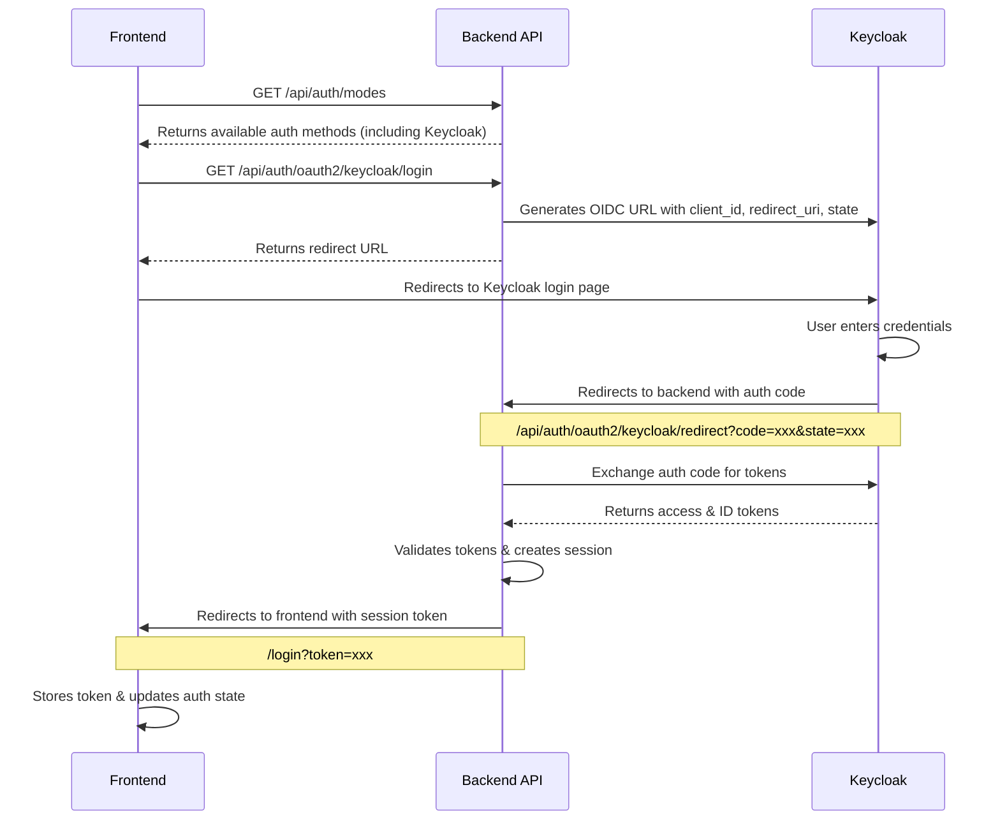

```mermaid
sequenceDiagram
    participant F as Frontend
    participant B as Backend API
    participant K as Keycloak

    %% Initialization
    F->>B: GET /api/auth/modes
    B-->>F: Returns available auth methods (including Keycloak)

    %% Start OIDC Flow
    F->>B: GET /api/auth/oauth2/keycloak/login
    B->>K: Generates OIDC URL with client_id, redirect_uri, state
    B-->>F: Returns redirect URL
    F->>K: Redirects to Keycloak login page

    %% User Authentication
    K->>K: User enters credentials
    K->>B: Redirects to backend with auth code
    Note over K,B: /api/auth/oauth2/keycloak/redirect?code=xxx&state=xxx

    %% Token Exchange
    B->>K: Exchange auth code for tokens
    K-->>B: Returns access & ID tokens
    B->>B: Validates tokens & creates session

    %% Complete Login
    B->>F: Redirects to frontend with session token
    Note over B,F: /login?token=xxx
    F->>F: Stores token & updates auth state

```
