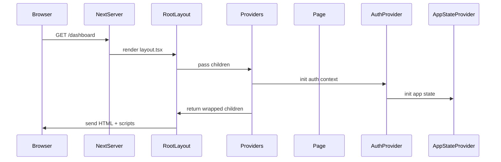

# Chapter 1: App Layout & Providers

Welcome to the very first chapter! Here we’ll learn how every page in our **alpha** app gets wrapped with the “scaffolding” it needs: global styles, fonts, analytics, and context providers.

---

## Why do we need a Layout & Providers?

Imagine you’re building a house. You lay a foundation, install walls, plumbing, and electricity before furnishing each room. In Next.js:

- **Layout** = the foundation + walls + basic wiring  
- **Providers** = plumbing and electricity (Auth, AppState, analytics, tours)

### Central use case

> **Use Case:** Show a protected dashboard page that needs:
> - User’s authentication state  
> - Global CSS and font  
> - Analytics script  
> - A guided tour  

Without a single place to set these up, you’d repeat boilerplate in every page. Let’s solve this by creating:

1. A **RootLayout** wrapping `<html>` & `<body>`.  
2. A **Providers** component loading initial data (like the logged-in user).  

---

## Key Concepts

1. **RootLayout** (like `_app.tsx`)  
2. **Global CSS & Fonts**  
3. **Matomo Analytics**  
4. **AuthProvider** & **AppStateProvider**  
5. **Third-party Tours** & **UI Toasts**  

We’ll go through each in turn.

---

## 1. RootLayout: your top-level HTML

This file lives at `src/app/layout.tsx` and defines the `<html>` and `<body>` tags for every page.

```tsx
export default async function RootLayout({ children }) {
  // Read cookies, decide if user is logged in
  const session = await cookies().get('session')
  const authenticated = Boolean(session)

  return (
    <html lang="en">
      <head>
        {/* Fonts, global scripts, meta tags */}
      </head>
      <body className="antialiased">
        <Providers>
          {children}
        </Providers>
        {/* Global UI banners, toasts */}
      </body>
    </html>
  )
}
```

- **cookies()**: Next.js helper to read cookies on the server.  
- **authenticated**: simple flag for user session.  
- **Providers**: our custom component (see next).

---

## 2. Global CSS & Fonts

Inside `layout.tsx` we import:

```tsx
import '@/app/build.css'
import '@/styles/globals.css'

// Load Rubik font from Google
import { Rubik } from 'next/font/google'
const rubik = Rubik({ subsets: ['latin'], variable: '--font-rubik' })
```

- `build.css` and `globals.css` apply Tailwind and app-wide styles.  
- The font applies a CSS variable `--font-rubik` that we put on `<body>`.  

---

## 3. Matomo Analytics

We want to track page views. In `<head>` we inject a script:

```tsx
<Script id="matomo" strategy="afterInteractive">
  {`
    var _mtm = window._mtm = window._mtm || [];
    _mtm.push({ event: 'mtm.Start' });
    // load Matomo container ...
  `}
</Script>
```

- **next/script** ensures the tag only runs after the page loads.  
- We pull the Matomo URL and container ID from environment variables.

---

## 4. Providers: Auth & AppState

`src/app/providers.tsx` figures out who’s logged in and passes that into context:

```tsx
async function getInitialAuthState() {
  const session = await cookies().get('session')
  if (!session?.value) return { authenticated: false }

  // Ask our API for user details
  try {
    const { data } = await userMe()
    return { authenticated: true, user: data }
  } catch {
    return { authenticated: false }
  }
}

export async function Providers({ children }) {
  const auth = await getInitialAuthState()

  return (
    <AuthProvider {...auth}>
      <AppStateProvider>
        {children}
      </AppStateProvider>
    </AuthProvider>
  )
}
```

- **getInitialAuthState** reads the “session” cookie.  
- If present, calls `userMe()` to fetch user info.  
- Wrap pages with `<AuthProvider>` and `<AppStateProvider>`.

---

## 5. Third-party Tours & Toasts

Inside the layout’s body we nest additional providers:

```tsx
<AuthProvider authenticated={true}>
  <AppStateProvider>
    <NextStepProvider>
      <NextStep steps={steps}>{children}</NextStep>
    </NextStepProvider>
    <Toaster />
  </AppStateProvider>
</AuthProvider>
```

- **NextStep** shows guided tours using `steps` you defined in `lib/tours.ts`.  
- **Toaster** displays toast notifications.

---

## What happens at runtime?

Let’s walk through a page request:



1. **Browser** requests a page.  
2. **NextServer** runs `layout.tsx`.  
3. **Providers** fetch initial auth state.  
4. Context providers wrap your page component.  
5. HTML, CSS, fonts, analytics script are sent to the client.

---

## Peek under the hood

- **AuthProvider** stores `authenticated` and `user` in a React Context.  
- **AppStateProvider** holds UI state (e.g., dark mode).  

Example: `src/components/store/auth-context.tsx`

```tsx
import { createContext, useContext, useState } from 'react'

const AuthContext = createContext({ authenticated: false, user: null })

export function AuthProvider({ authenticated, initialUser, children }) {
  const [user, setUser] = useState(initialUser)
  return (
    <AuthContext.Provider value={{ authenticated, user, setUser }}>
      {children}
    </AuthContext.Provider>
  )
}

export function useAuth() {
  return useContext(AuthContext)
}
```

- **createContext**: a container for global data.  
- **useAuth()**: hook to read/update the auth info anywhere in your app.

---

## Summary

In this chapter we learned:

- How to set up a **RootLayout** that wraps every page with HTML structure.  
- How to load **global CSS**, **fonts**, and **analytics**.  
- How to build a **Providers** component to fetch initial auth data.  
- How to wire up **AuthProvider**, **AppStateProvider**, **tours**, and **toasts**.  

Next up: controlling access and URL logic with middleware and routing.

[Chapter 2: Middleware & Routing](02_middleware___routing_.md)

---

Generated by [AI Codebase Knowledge Builder](https://github.com/The-Pocket/Tutorial-Codebase-Knowledge)