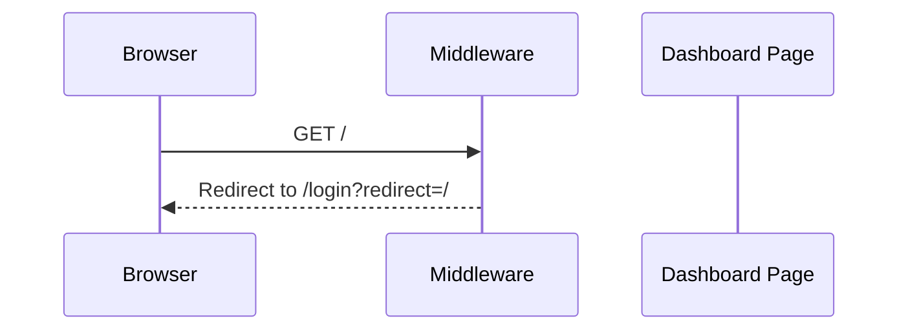
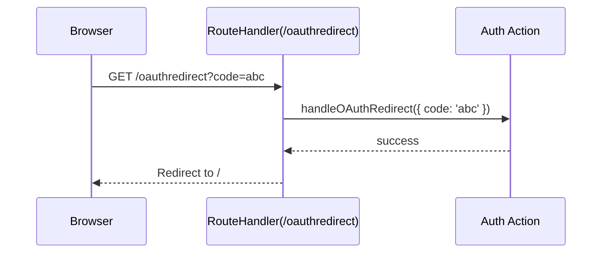

# Chapter 2: Middleware & Routing

Welcome back! In [Chapter 1: App Layout & Providers](01_app_layout___providers_.md), we wrapped every page in our **alpha** app with global styles, fonts, analytics, and context providers. Now, let’s add a “security guard” at the door to check who’s allowed in and handle special entry points like OAuth callbacks.

---

## Why Middleware & Routing?

Imagine your app is a building:
- **Pages** are rooms.
- **Layout & Providers** set up electricity and heating everywhere.
- **Middleware** is the security guard at the entrance.
- **Route Handlers** are special staff who handle one-off tasks (like welcoming OAuth guests).

**Central Use Case:**  
You have a protected Dashboard at `/`. If a visitor isn’t logged in, send them to `/login?redirect=/`.  
Also, after an OAuth login flow, you want to catch the callback at `/oauthredirect` and finish signing them in.

---

## Key Concepts

1. **Middleware** – Runs *before* any page or API. Can rewrite, redirect, or run checks.  
2. **Route Handlers** – File-based functions (GET, POST) living under `app/.../route.ts`. Great for one-off endpoints like `/oauthredirect`.

---

## 2.1 Protecting Pages with Middleware

Create a `middleware.ts` in your project root:

```ts
// File: middleware.ts
import type { NextRequest } from 'next/server'

export async function middleware(request: NextRequest) {
  const session = request.cookies.get('session')?.value

  // If no session and visiting root, redirect to login
  if (!session && request.nextUrl.pathname === '/') {
    const loginUrl = new URL('/login', request.url)
    loginUrl.searchParams.set('redirect', '/')
    return Response.redirect(loginUrl)
  }

  // (Optional) Add more rules for other pages...
}

export const config = {
  matcher: ['/((?!api|_next).*)'], // Only run on non-API, non-static routes
}
```

Explanation:
- We read the `session` cookie.
- If it’s missing and the user visits `/`, we redirect to `/login?redirect=/`.
- `matcher` tells Next.js which paths to guard.

---

## 2.2 Handling OAuth Callback with a Route Handler

When users sign in via OAuth (Keycloak, Google, etc.), they’re sent back with a code. Let’s catch that at `/oauthredirect`:

```ts
// File: src/app/oauthredirect/route.ts
import { NextRequest } from 'next/server'
import { handleOAuthRedirect } from '@/components/actions/authentication-view-model'

export async function GET(request: NextRequest) {
  const code = request.nextUrl.searchParams.get('code') || ''
  try {
    // Complete login on the server
    await handleOAuthRedirect({ code })
    // On success, send them home
    return Response.redirect('/')
  } catch {
    // On error, send back to login
    return Response.redirect('/login?error=Authentication failed')
  }
}
```

Explanation:
- Next.js calls this `GET` when a browser hits `/oauthredirect`.
- We grab the `code` query param, call our action, then redirect.

---

## 2.3 Request Flow Diagram

Here’s what happens when someone tries to see the Dashboard:



And when OAuth redirects back:



---

## 2.4 What’s Happening Under the Hood?

1. **Next.js** sees an incoming request.  
2. It runs your **middleware** (if the path matches).  
   - You can check cookies, call `updateSession()`, and decide to redirect.  
3. If the path is `/oauthredirect`, it finds your **route handler** file and runs `GET`.  
4. Otherwise, it serves your page from the `app/` folder.

---

### Minimal `updateSession` Example

In `middleware.ts` you might call a helper that refreshes JWT cookies:

```ts
// File: src/components/actions/authentication-view-model.ts
export async function updateSession(request: NextRequest) {
  // Check if token is about to expire...
  // Call your API to refresh it
  // Set a new cookie on the response
}
```

This keeps users logged in seamlessly.

---

## Summary

In this chapter you learned how to:

- Use **middleware** (`middleware.ts`) as a security guard—checking sessions and redirecting.  
- Create **route handlers** (`route.ts`) to finalize OAuth flows.  
- Visualize the request flow with Mermaid.  

Next up is wiring this into your UI state: [Chapter 3: React Contexts (Auth & AppState)](03_react_contexts__auth___appstate__.md). 

Great job—onward to more powerful abstractions!

---

Generated by [AI Codebase Knowledge Builder](https://github.com/The-Pocket/Tutorial-Codebase-Knowledge)