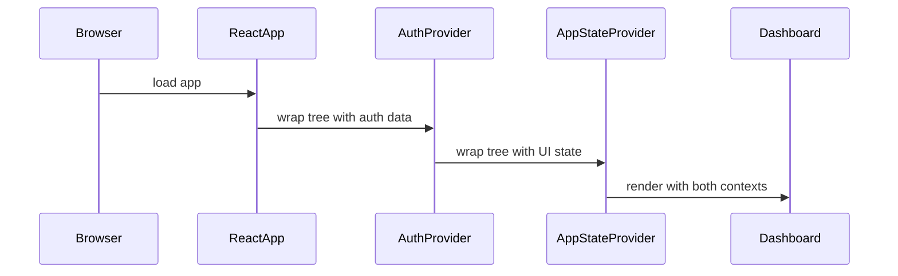

# Chapter 3: React Contexts (Auth & AppState)

In [Chapter 2: Middleware & Routing](02_middleware___routing_.md) we learned how to guard pages and handle special endpoints. Now, let’s build two shared “notebooks”—React Contexts—that any component can open to read or write data without messy prop-drilling.

---

## Why React Contexts?

Imagine you have a shared notebook in the office that everyone can grab to jot down or look up notes. In React:

- Passing props is like whispering messages along a chain of people.
- Context is that common notebook on the table—anyone can use it directly.

We need two notebooks:

1. **Auth Context**: Who is logged in, who out, and how to update their status.  
2. **AppState Context**: Global UI flags (sidebars, toggles), notifications, lists (workspaces).

### Central Use Case

> Build a **Dashboard** that:
> - Reads the current user’s name.  
> - Shows or hides a sidebar when a button is clicked.

---

## Key Concepts

1. **Auth Context** holds:
   - `isAuthenticated`: boolean  
   - `user`: object (e.g. `{ name: "Alice" }`)  
   - `setAuthenticated()`: update login status  

2. **AppState Context** holds:
   - `showSidebar`: boolean  
   - `toggleSidebar()`: flip the sidebar on/off  

---

## Using Contexts in a Component

Here’s a minimal Dashboard that uses both notebooks:

```tsx
'use client'
import { useAuth } from '@/components/store/auth-context'
import { useAppState } from '@/components/store/app-state-context'

export function Dashboard() {
  const { user } = useAuth()
  const { showSidebar, toggleSidebar } = useAppState()

  return (
    <div>
      <h1>Welcome, {user?.name || 'Guest'}!</h1>
      <button onClick={toggleSidebar}>
        {showSidebar ? 'Hide' : 'Show'} Sidebar
      </button>
    </div>
  )
}
```

Explanation:
- `useAuth()` gives us user info.  
- `useAppState()` gives us the sidebar flag and a toggle function.  
- Clicking updates the shared context—and any component reading `showSidebar` will update too.

---

## What Happens Under the Hood?  



1. **Browser** loads your React app.  
2. **AuthProvider** and **AppStateProvider** (set up in [Chapter 1](01_app_layout___providers_.md)) wrap the page tree.  
3. **Dashboard** calls `useAuth()` and `useAppState()` to read from those shared contexts.

---

## Under the Hood: Auth Context Code

File: `src/components/store/auth-context.tsx`

```tsx
'use client'
import { createContext, useContext, useState, ReactNode } from 'react'

// 1) Define what lives in AuthContext
type AuthContextType = {
  isAuthenticated: boolean
  user?: { name: string }
  setAuthenticated: (val: boolean) => void
}

// 2) Create with safe defaults
const AuthContext = createContext<AuthContextType>({
  isAuthenticated: false,
  setAuthenticated: () => {}
})
```

```tsx
// 3) Build the provider
export function AuthProvider({
  initialAuth,
  initialUser,
  children
}: {
  initialAuth: boolean
  initialUser?: { name: string }
  children: ReactNode
}) {
  const [isAuthenticated, setAuthenticated] = useState(initialAuth)
  const [user] = useState(initialUser)

  return (
    <AuthContext.Provider
      value={{ isAuthenticated, user, setAuthenticated }}
    >
      {children}
    </AuthContext.Provider>
  )
}

// 4) Hook for easy access
export function useAuth() {
  return useContext(AuthContext)
}
```

---

## Under the Hood: AppState Context Code

File: `src/components/store/app-state-context.tsx`

```tsx
'use client'
import { createContext, useContext, useState, ReactNode } from 'react'

// 1) Define UI flags
type AppStateContextType = {
  showSidebar: boolean
  toggleSidebar: () => void
}

// 2) Default values
const AppStateContext = createContext<AppStateContextType>({
  showSidebar: true,
  toggleSidebar: () => {}
})
```

```tsx
// 3) Provider with state logic
export function AppStateProvider({ children }: { children: ReactNode }) {
  const [showSidebar, setShow] = useState(true)
  const toggleSidebar = () => setShow(prev => !prev)

  return (
    <AppStateContext.Provider value={{ showSidebar, toggleSidebar }}>
      {children}
    </AppStateContext.Provider>
  )
}

// 4) Hook for components
export function useAppState() {
  return useContext(AppStateContext)
}
```

---

## Putting It All Together

In [Chapter 1: App Layout & Providers](01_app_layout___providers_.md), we saw how these providers wrap your entire app:

```tsx
// src/app/providers.tsx
export function Providers({ children }) {
  return (
    <AuthProvider initialAuth={true} initialUser={{ name: 'Alice' }}>
      <AppStateProvider>{children}</AppStateProvider>
    </AuthProvider>
  )
}
```

Now every component under `<Providers>` can open the shared notebooks.

---

## Summary

You’ve learned how to:

- Create a **global notebook** (React Context) for authentication and UI state.  
- Build **providers** that wrap your app and hold shared data.  
- Write **hooks** (`useAuth`, `useAppState`) for any component to read or update that data.

No more prop-drilling—components stay focused on their UI.

Next, we’ll connect your UI to server logic: [Chapter 4: View-Model / Server Actions](04_view_model___server_actions_.md).  

Happy coding!

---

Generated by [AI Codebase Knowledge Builder](https://github.com/The-Pocket/Tutorial-Codebase-Knowledge)