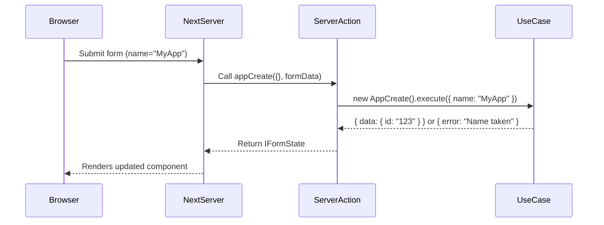

# Chapter 4: View-Model / Server Actions

In [Chapter 3: React Contexts (Auth & AppState)](03_react_contexts__auth___appstate__.md) we learned how to share state (like the current user and UI flags) across components. Now it’s time to connect those components to our server-side logic: that’s where **View-Model / Server Actions** come in.

---

## Why Server Actions?

Imagine you have a form on the client and a bunch of domain “use-cases” on the server (create a workspace, delete an app, log in a user, etc.). You need a thin layer that:

1. Gathers form data from the browser.  
2. Calls the right use-case (e.g. `WorkspaceCreate`).  
3. Returns a tidy response object that your UI can inspect (errors, validation issues, success messages).

In a classic MVC app, you’d write controllers. In Next.js 14+, we use **Server Actions** living under `src/components/actions` as our “controllers.”

**Central Use Case:**  
Build a “Create App” form. When a user submits:
- Package the fields into a model.  
- Validate input server-side.  
- Call the `AppCreate` use-case.  
- Return `{ error }` or `{ data }` so the UI shows success or errors.

---

## Key Concepts

1. **`'use server'` directive**  
   Marks a file or function to run only on the server.  

2. **Action signature**  
   Most actions look like:
   ```ts
   export async function myAction(
     prevState: IFormState,
     formData: FormData
   ): Promise<IFormState> { … }
   ```
   - `prevState`: the current UI state (error, data, issues).  
   - `formData`: the submitted form values.

3. **Returning structured state**  
   Actions return an `IFormState` object:
   ```ts
   interface IFormState {
     data?: any      // success payload or message
     error?: string  // error message
     issues?: any[]  // validation issues
   }
   ```

4. **Calling from React**  
   In a client component, assign the action to a `<form>`:
   ```tsx
   'use client'
   import { appCreate } from '@/components/actions/app-view-model'

   export function CreateAppForm() {
     return (
       <form action={appCreate}>
         <input name="name" placeholder="App name" />
         <button type="submit">Create</button>
       </form>
     )
   }
   ```
   Next.js will automatically call your server action with the submitted data.

---

## Using a Server Action: “Create App” Example

1. Create a simple client component:

```tsx
'use client'
import { appCreate } from '@/components/actions/app-view-model'
import { useState } from 'react'

export function CreateAppForm() {
  const [result, setResult] = useState({})
  
  return (
    <>
      <form  
        action={async (formData: FormData) => {
          const res = await appCreate({}, formData)
          setResult(res)
        }}
      >
        <input name="name" placeholder="App name" required />
        <button type="submit">Create</button>
      </form>

      {result.error && <p style={{ color: 'red' }}>{result.error}</p>}
      {result.data && <p style={{ color: 'green' }}>{result.data}</p>}
    </>
  )
}
```

Explanation:
- We call `appCreate` with an empty `prevState` and the form’s `FormData`.  
- On return, we stash the result in React state.  
- We render either an error or success message.

---

## What Happens Under the Hood?



1. The browser submits the form.  
2. Next.js routes it to your server action (`appCreate`).  
3. `appCreate` builds a model, validates it, and calls the domain use-case.  
4. The use-case returns success or error.  
5. You return `{ data }` or `{ error }` back to the client.  
6. The client UI updates with your message.

---

## Inside `app-view-model.ts`

Let’s peek at a simplified version of the real file.  

File: `src/components/actions/app-view-model.ts`

```ts
'use server'
import { AppCreate } from '~/domain/use-cases/app/app-create'
import { IFormState } from './utils'

export async function appCreate(
  prevState: IFormState,
  formData: FormData
): Promise<IFormState> {
  // 1) Read input
  const name = formData.get('name') as string

  // 2) Simple validation
  if (!name) {
    return { ...prevState, error: 'Name is required' }
  }

  // 3) Call domain use-case
  const result = await new AppCreate(/* repo */).execute({ name })

  // 4) Return structured state
  if (result.error) {
    return { ...prevState, error: result.error }
  }
  return { data: 'App created successfully' }
}
```

Explanation:
- `'use server'` means this code never runs in the browser.  
- We read `FormData`, do safety checks, call our business logic (`AppCreate`), and return a neat object.

---

## Summary

In this chapter you learned how to:

- Write **Server Actions** under `src/components/actions` as your Next.js “controllers.”  
- Use `'use server'` functions to package form data, call use-cases, and return `{ data, error, issues }`.  
- Call actions directly from client `<form action={…}>` or an async handler.  
- Visualize the flow with a Mermaid sequence diagram.

Next, we’ll build a shared set of UI components to glue all this together.  
[Chapter 5: UI Component Library](05_ui_component_library_.md)

---

Generated by [AI Codebase Knowledge Builder](https://github.com/The-Pocket/Tutorial-Codebase-Knowledge)