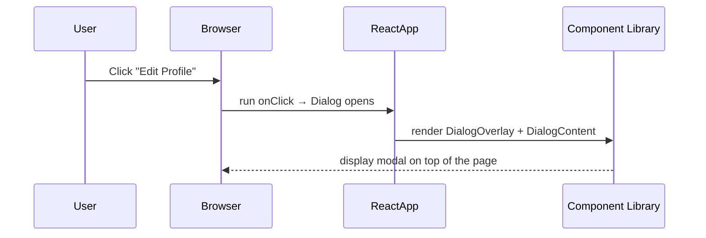

# Chapter 5: UI Component Library

Welcome back! In [Chapter 4: View-Model / Server Actions](04_view_model___server_actions_.md) we connected our forms and buttons to real server logic. Now, let’s make those buttons and forms look great—everywhere—using our **UI Component Library**.

---

## Why a UI Component Library?

Imagine you have a big box of LEGO bricks.  
- Every page or feature in your app is a unique model you build.  
- But you don’t want to re-invent the wheel: you want standard bricks that always fit and look consistent.

A **UI Component Library** is that box of bricks:  
- **Button**, **Card**, **Table**, **Dialog**, etc.  
- Live in `src/components/ui`  
- Guarantee the same styling, spacing, and behavior across your whole **alpha** app.

**Central Use Case:**  
Build a tiny “User Profile Card” with an **Edit** button that opens a **Dialog**. We’ll glue together `Card`, `Button`, and `Dialog` primitives.

---

## Key Concepts

1. **Primitives**  
   Basic building blocks (`Button`, `Card`, `Input`, `Dialog`, …) exported from `components/ui`.  

2. **Variants & Sizes**  
   Many components support props like `variant="destructive"` or `size="sm"` for easy theming.  

3. **Composition with asChild**  
   Some primitives (like `DialogTrigger`) accept an `asChild` prop to render your own component underneath (e.g., `<Button>`).

4. **Consistent Styling**  
   We use utilities (Tailwind + `class-variance-authority`) so every component shares the same design tokens.

---

## Solving the Use Case

Let’s build a **UserProfile** card:

```tsx
'use client'
import {
  Card, CardHeader, CardTitle, CardContent
} from '@/components/ui/card'
import { Button } from '@/components/ui/button'
import {
  Dialog, DialogTrigger, DialogContent, DialogTitle
} from '@/components/ui/dialog'

export function UserProfile() {
  return (
    <Card>
      <CardHeader>
        <CardTitle>Jane Doe</CardTitle>
      </CardHeader>
      <CardContent>
        <p>Email: jane@example.com</p>
        <Dialog>
          <DialogTrigger asChild>
            <Button variant="secondary">Edit Profile</Button>
          </DialogTrigger>
          <DialogContent>
            <DialogTitle>Edit Your Info</DialogTitle>
            {/* form fields go here */}
          </DialogContent>
        </Dialog>
      </CardContent>
    </Card>
  )
}
```

What happens here?

- We lay out a **Card** with header, title, and content.  
- Inside the card, a **DialogTrigger** wraps our **Button** (because of `asChild`) so clicking **Edit Profile** opens the dialog.  
- **DialogContent** shows a modal where we could put a form.

---

### Step-by-Step Flow



---

## Under the Hood: How Button Works

### 1. What Happens When You Render `<Button variant="destructive" size="sm">`?

1. React calls your `Button` component with `props.variant='destructive'` and `props.size='sm'`.  
2. `class-variance-authority` (`cva`) merges base styles + variant styles.  
3. You get a string of CSS classes like `"inline-flex … bg-destructive h-9 px-3"`.  
4. The `<button>` element finally renders with those classes.

### 2. Simplified Code Example

File: `src/components/ui/button.tsx`

```ts
import { cva } from 'class-variance-authority'

// 1) Define classes and variants
const buttonStyles = cva(
  'inline-flex items-center rounded-md font-medium',
  {
    variants: {
      variant: {
        default: 'bg-blue text-white',
        destructive: 'bg-red text-white'
      },
      size: {
        default: 'h-10 px-4',
        sm: 'h-9 px-3'
      }
    },
    defaultVariants: {
      variant: 'default',
      size: 'default'
    }
  }
)

// 2) Render a <button> with computed classes
export function Button({ variant, size, className, children, ...props }) {
  const classes = buttonStyles({ variant, size })
  return (
    <button className={`${classes} ${className || ''}`} {...props}>
      {children}
    </button>
  )
}
```

After this, any `<Button>` you use in **alpha** will follow the same style rules.

---

## Under the Hood: How Card Works

Cards are simpler wrappers for consistent padding, border, and shadow.

File: `src/components/ui/card.tsx`

```ts
export function Card({ className, children }) {
  return (
    <div
      className={`rounded-lg border bg-white shadow-sm p-4 ${className || ''}`}
    >
      {children}
    </div>
  )
}

export function CardHeader({ children, className }) {
  return <div className={`pb-2 ${className || ''}`}>{children}</div>
}
export function CardTitle({ children, className }) {
  return <h3 className={`text-lg font-semibold ${className || ''}`}>{children}</h3>
}
export function CardContent({ children, className }) {
  return <div className={className}>{children}</div>
}
```

Every card in your app now has the same round corners, padding, and shadow.

---

## Putting It All Together

1. Install and import the components you need from `components/ui`.  
2. Use props like `variant`, `size`, and `asChild` to adjust look and behavior.  
3. Compose them in your pages and features without rewriting CSS.

This keeps your UI:
- Consistent (same look everywhere)  
- Easy to update (change one `cva` definition, and all buttons update)  
- Focused on functionality (you don’t worry about styling in every component)

---

## Conclusion

In this chapter, you learned how to:

- Treat **UI primitives** as your LEGO bricks (`Button`, `Card`, `Dialog`, …).  
- Use **variants** and **sizes** for flexible theming.  
- Leverage **asChild** to compose triggers and custom components.  
- Peek under the hood at simple `cva` utilities and wrapper components.

Next up, we'll show you how to build full pages by combining these bricks with data and logic:  
[Chapter 6: Page & Feature Components](06_page___feature_components_.md)

---

Generated by [AI Codebase Knowledge Builder](https://github.com/The-Pocket/Tutorial-Codebase-Knowledge)