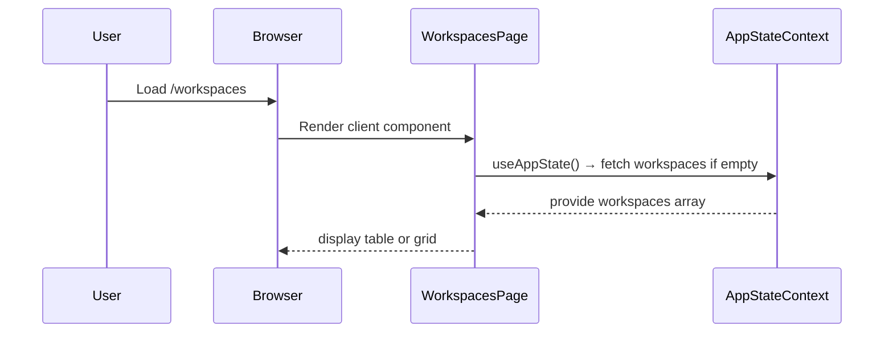
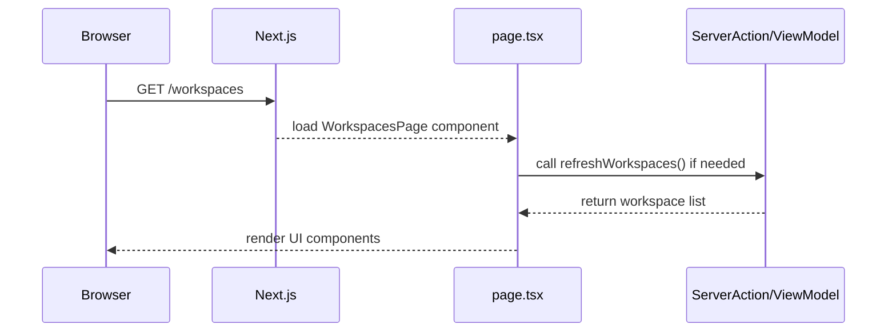

# Chapter 6: Page & Feature Components

Welcome back! In [Chapter 5: UI Component Library](05_ui_component_library_.md) we learned how to build buttons, cards, dialogs, tables, and more as reusable “LEGO bricks.” Now, let’s put those bricks together into **pages** and **feature components**—the actual rooms and exhibits in our app’s interactive story.

---

## Why Page & Feature Components?

Imagine your app is a storybook:

- **Pages** = each chapter in the book (Home, Workspaces list, Workspace detail, App Store, Login/Register)  
- **Feature Components** = the scenes or illustrations inside each chapter (Workspace card, workbench list, app-store grid)

Together they:

1. Use a **Layout** (from [Chapter 1](01_app_layout___providers_.md))  
2. Read/write **Context** (from [Chapter 3](03_react_contexts__auth___appstate__.md))  
3. Call **View-Models/Server Actions** (from [Chapter 4](04_view_model___server_actions_.md))  
4. Render **UI Components** (from [Chapter 5](05_ui_component_library_.md))

**Central Use Case:** Build a **Workspaces** page where users can:
- See their workspaces in a grid or table  
- Toggle between views  
- Open a “Create Workspace” dialog  

We’ll start with a minimal version of `src/app/workspaces/page.tsx`.

---

## Key Concepts

1. **Page Component**  
   - Lives under `src/app/.../page.tsx`  
   - Controls data fetching, context hooks, and composition of feature parts  

2. **Feature Component**  
   - Lives anywhere under `src/components/...`  
   - Encapsulates a specific UI+logic piece (e.g., `<Workspace />`, `<AppStoreView />`)  

3. **Routing & File Conventions**  
   - Next.js maps `app/workspaces/page.tsx` → `/workspaces`  
   - Dynamic segments (e.g. `[workspaceId]`) become URL params  

4. **Composition**  
   - Page pulls data via context or server actions  
   - Page places UI primitives and feature components on screen  

---

## 6.1 Building `WorkspacesPage`

Here’s a **very minimal** version:

```tsx
// File: src/app/workspaces/page.tsx
'use client'

import { useAuth } from '@/components/store/auth-context'
import { useAppState } from '@/components/store/app-state-context'
import { Tabs, TabsList, TabsTrigger, TabsContent } from '@/components/ui/tabs'
import { WorkspaceTable } from '@/components/workspaces/WorkspaceTable'
import { WorkspacesGrid } from '@/components/workspaces/WorkspacesGrid'
import { WorkspaceCreateForm } from '@/components/forms/workspace-forms'

export default function WorkspacesPage() {
  const { user } = useAuth()
  const {
    workspaces,
    showWorkspacesTable,
    toggleWorkspaceView,
    refreshWorkspaces
  } = useAppState()

  return (
    <div>
      <h2>Workspaces</h2>
      <button onClick={toggleWorkspaceView}>
        {showWorkspacesTable ? 'Grid' : 'Table'}
      </button>

      {showWorkspacesTable ? (
        <WorkspaceTable workspaces={workspaces} onRefresh={refreshWorkspaces} />
      ) : (
        <WorkspacesGrid workspaces={workspaces} />
      )}

      <WorkspaceCreateForm onCreated={refreshWorkspaces} userId={user?.id} />
    </div>
  )
}
```

Explanation:

1. We mark `'use client'` because we use React hooks.  
2. We read `user` from `[Chapter 3: React Contexts](03_react_contexts__auth___appstate__.md)`.  
3. We read workspaces and view flags from AppState.  
4. We conditionally render a **table** or **grid** feature component.  
5. We include a **create form** that refreshes the list on success.

---

## 6.2 What Happens at Runtime?



1. Browser hits `/workspaces`.  
2. Next.js renders our page component on the client.  
3. `useAppState()` kicks off data loading if needed.  
4. Once data arrives, the page shows the feature components.

---

## 6.3 Deep Dive: Feature Component `<WorkspacesGrid />`

A feature component groups UI primitives with minimal logic. Here’s a stripped-down version:

```tsx
// File: src/components/workspaces/WorkspacesGrid.tsx
import { Card } from '@/components/ui/card'
import Link from 'next/link'

export function WorkspacesGrid({ workspaces }) {
  return (
    <div className="grid grid-cols-3 gap-4">
      {workspaces?.map(ws => (
        <Card key={ws.id}>
          <h3>{ws.name}</h3>
          <Link href={`/workspaces/${ws.id}`}>View</Link>
        </Card>
      ))}
    </div>
  )
}
```

Explanation:

- We loop over `workspaces`.  
- For each, we render a styled card with a title and a link.

---

## 6.4 Under the Hood: Routing & Data

1. **File-based Routing**  
   - `app/workspaces/page.tsx` → `/workspaces`  
   - `app/workspaces/[workspaceId]/page.tsx` → `/workspaces/:workspaceId`  

2. **Dynamic Segments & Params**  
   - In `[workspaceId]/page.tsx`, call `useParams()` to get `workspaceId`.  

3. **Data Fetch**  
   - Use Effects or Server Actions from [Chapter 4](04_view_model___server_actions_.md) to fetch workspace detail.

---

## 6.5 Internal Flow Diagram



---

## Conclusion

In this chapter you learned how to:

- Build **Page Components** under `src/app` that orchestrate layout, context, view-models, and UI bricks.  
- Create **Feature Components** in `src/components` for reusable scenes like grids, tables, or cards.  
- Use Next.js file-based routing to map files to URLs.  
- See the end-to-end flow from user → page → context → view-model → UI.

Next up: digging into our **Use-Case Layer**, where the real business rules live.  
[Chapter 7: Use-Case Layer](07_use_case_layer_.md)

---

Generated by [AI Codebase Knowledge Builder](https://github.com/The-Pocket/Tutorial-Codebase-Knowledge)