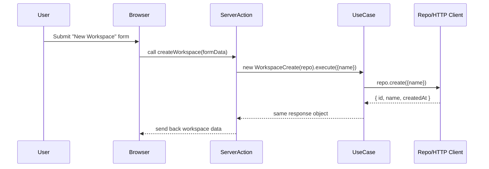

# Chapter 7: Use-Case Layer

In [Chapter 6: Page & Feature Components](06_page___feature_components_.md) we learned how to glue UI bricks into pages and features. Now it’s time to introduce the **Use-Case Layer**—the place where our real business rules live.

---

## Why a Use-Case Layer?

Imagine your app is a kitchen.  
- **Repositories** are your ingredients and tools (flour, sugar, mixing bowls).  
- **Use-Cases** are your recipes (Cookies, Pancakes).  

A use-case encapsulates a single, high-level business operation—like **CreateWorkspace** or **ListApps**. It orchestrates repositories, applies rules, and returns a clear result. This keeps your UI or server actions thin and intent-driven.

### Central Use Case: Create a Workspace

When a user submits a “New Workspace” form, we want to:

1. Validate the name.  
2. Call our storage API to save it.  
3. Return the new workspace or an error.  

A **CreateWorkspace** use-case wraps these steps into one `.execute()` call.

---

## Key Concepts

1. **Single Responsibility**  
   Each use-case does *one* thing: create, list, get, update, or delete.

2. **Constructor Injection**  
   We pass in the repository to the constructor so the use-case can call it.

3. **`.execute(data)`**  
   A promise-based method that runs the recipe and returns a response.

---

## How to Use a Use-Case

Below is a minimal server action (see [Chapter 4: View-Model / Server Actions](04_view_model___server_actions_.md)) that calls our use-case.

```ts
// src/components/actions/workspace-view-model.ts
'use server'
import { WorkspaceCreate } from '~/domain/use-cases/workspace/workspace-create'
import { workspaceRepository } from '~/data/repositories'

// A form action to create a workspace
export async function createWorkspace(formData: FormData) {
  const name = formData.get('name') as string
  const useCase = new WorkspaceCreate(workspaceRepository)
  return await useCase.execute({ name })
}
```

Explanation:
- We read the form field `name`.  
- We instantiate `WorkspaceCreate` with our repo.  
- We call `execute({ name })` and return its result.

---

## What Happens Under the Hood?



1. **ServerAction** calls `.execute()` on the use-case.  
2. The **UseCase** calls its **Repository**.  
3. The **Repository** talks to an API or database.  
4. The response bubbles back through the use-case to your UI.

---

## Inside a Use-Case File

Here’s a simplified version of `workspace-create.ts`:

```ts
// src/domain/use-cases/workspace/workspace-create.ts
export interface WorkspaceCreateModel { name: string }
export interface WorkspaceResponse { id: string; name: string }

export class WorkspaceCreate {
  constructor(private repo: { create(data: WorkspaceCreateModel): Promise<WorkspaceResponse> }) {}

  async execute(data: WorkspaceCreateModel): Promise<WorkspaceResponse> {
    // You could add validation or extra rules here
    return await this.repo.create(data)
  }
}
```

Explanation:
- The interface defines input (`WorkspaceCreateModel`) and output (`WorkspaceResponse`).  
- The class stores `repo` in its constructor.  
- `execute()` calls the repository and returns its result.

---

## Why This Helps

- **Separation of Concerns**: UI code just calls a method, no detailed business logic.  
- **Testable**: You can unit-test each use-case with a fake repository.  
- **Reusability**: Multiple actions or controllers can share the same use-case.

---

## Summary

In this chapter you learned:

- What the **Use-Case Layer** is and why it’s like a recipe book.  
- How to define a use-case with `constructor(repo)` and `execute(data)`.  
- How server actions call use-cases so your UI stays clean.  
- The end-to-end flow from form → use-case → repository → API.

Next up: dive into the ingredients themselves—the **Repository Layer**, which talks to APIs or databases.  
[Chapter 8: Repository Layer](08_repository_layer_.md)

---

Generated by [AI Codebase Knowledge Builder](https://github.com/The-Pocket/Tutorial-Codebase-Knowledge)