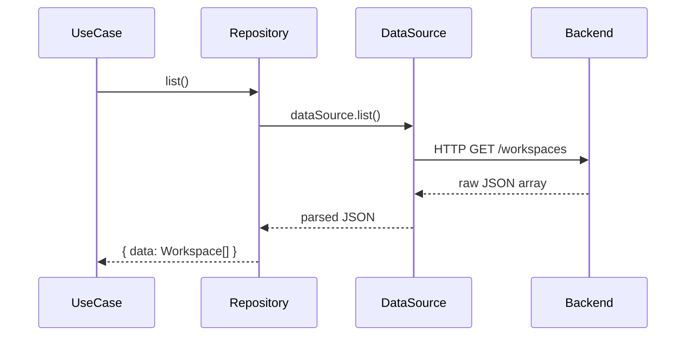

# Chapter 8: Repository Layer

Welcome back! In [Chapter 7: Use-Case Layer](07_use_case_layer_.md) we learned how each business operation lives in a use-case class. Now we’ll build the **Repository Layer**—the “gatekeepers” that sit between those use-cases and the raw data sources (HTTP APIs, databases, SDKs).

---

## Why a Repository Layer?

Imagine you have a chef (use-case) who needs ingredients. Repositories are like the kitchen staff who:

1. Fetch ingredients from the pantry (data source).  
2. Clean and prepare them (map raw JSON to domain objects).  
3. Handle mistakes (missing data, network errors).  
4. Hand back a uniform basket: `{ data, error }`.

This keeps your use-cases clean—they just ask for `{ data }` or handle `{ error }` without worrying about HTTP or fetch details.

**Central Use Case:**  
A user wants to **list their workspaces**. The `ListWorkspaces` use-case will call `workspaceRepository.list()`. That method should return either:
- `{ data: Workspace[] }` on success  
- `{ error: string }` on failure  

Your UI or server action can then react in a consistent way.

---

## Key Concepts

1. **Repository Interface**  
   A TypeScript interface in `src/domain/repository` defining method names and return shapes.

2. **Repository Implementation**  
   A class in `src/data/repository` that implements the interface, uses a data‐source client, and wraps calls in `try/catch`.

3. **Uniform Responses**  
   Every method returns a promise resolving to `{ data?: T; error?: string }`.

4. **Error Handling**  
   Repositories catch exceptions, log them, and return a friendly error message.

---

## How to Use a Repository

In your use-case you simply do:

```ts
// src/domain/use-cases/workspace/list-workspaces.ts
import { WorkspaceRepository } from '~/domain/repository'

export class ListWorkspaces {
  constructor(private repo: WorkspaceRepository) {}

  async execute() {
    const result = await this.repo.list()
    return result  // { data: Workspace[] } or { error: string }
  }
}
```

The use-case doesn’t know about HTTP—just calls `repo.list()` and passes the result on.

---

## What Happens When You Call `repo.list()`



1. Use-case asks the repository to `list()`.  
2. Repo calls its injected data-source client.  
3. Data-source makes the HTTP request, parses JSON.  
4. Repo wraps that in `{ data }`, or `{ error }` on failure.  
5. Use-case gets a consistent response shape.

---

## Under the Hood: Interface & Implementation

### 1) Repository Interface

File: `src/domain/repository/workspace-repository.ts`

```ts
import { Workspace, WorkspacesResponse } from '@/domain/model'

export interface WorkspaceRepository {
  list(): Promise<WorkspacesResponse>
  create(data: { name: string }): Promise<{ data?: Workspace; error?: string }>
  // … other methods: get, update, delete
}
```

- `WorkspacesResponse` is `{ data: Workspace[]; error?: string }`.  
- The interface defines **what** the repository does, not **how**.

### 2) Repository Implementation

File: `src/data/repository/workspace-repository-impl.ts`

```ts
import { WorkspaceRepository } from '@/domain/repository'
import { WorkspaceDataSource } from '@/data/data-source'

export class WorkspaceRepositoryImpl implements WorkspaceRepository {
  constructor(private ds: WorkspaceDataSource) {}

  async list() {
    try {
      const data = await this.ds.list()           // HTTP call
      return { data }                             // Success
    } catch (err) {
      console.error('Error listing workspaces', err)
      return { error: (err as Error).message }    // Friendly error
    }
  }

  async create({ name }: { name: string }) {
    try {
      const id = await this.ds.create({ name })   // returns new id
      const data = await this.ds.get(id)          // fetch full object
      return { data }
    } catch (err) {
      console.error('Error creating workspace', err)
      return { error: (err as Error).message }
    }
  }
}
```

- **Constructor Injection**: we pass in `WorkspaceDataSource`.  
- **Try/Catch** around every call to catch network or parsing errors.  
- **Uniform Return** shapes `{ data }` or `{ error }`.

---

## Putting It All Together

1. **Wire Up** your repository in a central place:
   ```ts
   // src/data/repositories.ts
   import { WorkspaceDataSource } from './data-source'
   import { WorkspaceRepositoryImpl } from './repository/workspace-repository-impl'

   export const workspaceRepository = 
     new WorkspaceRepositoryImpl(new WorkspaceDataSource())
   ```
2. **Inject** into your use-cases:
   ```ts
   import { ListWorkspaces } from '~/domain/use-cases/workspace/list-workspaces'
   import { workspaceRepository } from '@/data/repositories'

   const useCase = new ListWorkspaces(workspaceRepository)
   const result = await useCase.execute()
   ```
3. **Consume** in server actions or UI:
   ```ts
   // server action
   const { data, error } = await new ListWorkspaces(workspaceRepository).execute()
   if (error) throw new Error(error)
   return data  // Workspace[]
   ```

---

## Summary

In this chapter you learned how to:

- Define a **Repository Interface** in the domain layer.  
- Write a **Repository Implementation** that uses a data-source client, handles errors, and returns `{ data, error }`.  
- Keep your use-cases clean—just calling `repo.method()` and trusting a uniform response.  

Next up: the low-level **Data-Source Layer**, where we actually make HTTP calls or database queries.  
[Chapter 9: Data-Source Layer (API Clients)](09_data_source_layer__api_clients__.md)

---

Generated by [AI Codebase Knowledge Builder](https://github.com/The-Pocket/Tutorial-Codebase-Knowledge)