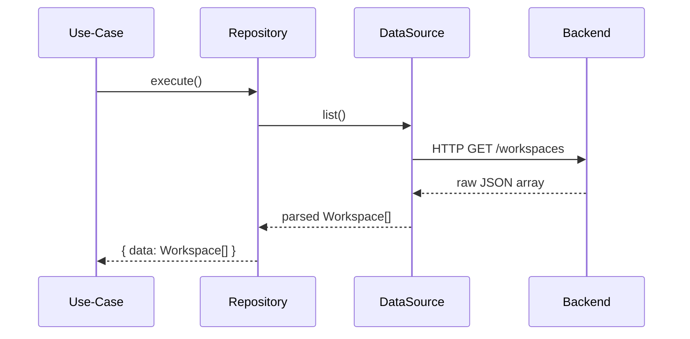

# Chapter 9: Data-Source Layer (API Clients)

In [Chapter 8: Repository Layer](08_repository_layer_.md) we built **repositories** that your use-cases call. Now it’s time to look one level deeper at the **Data-Source Layer**—the “drivers” that actually speak HTTP or talk to a database.

---

## Why a Data-Source Layer?

Imagine you have a car (your repository) and need to drive across town.  
- **DataSource** = the engine and transmission that know how to turn fuel (HTTP requests) into motion (data).  
- **Repository** uses that engine without caring whether it’s gas, diesel, or electric.

**Central Use Case:**  
Your **ListWorkspaces** use-case calls `workspaceRepository.list()`.  
  → Under the hood, your repository calls `WorkspaceDataSource.list()`.  
  → That DataSource sends an HTTP request to `/workspaces` and returns raw JSON.  
  → The repository wraps it in `{ data, error }` for the use-case.

---

## Key Concepts

1. **Data-Source Interface**  
   Defines methods like `list()`, `get(id)`, `create(data)`. Lives in `src/data/data-source/*.ts`.

2. **Concrete Implementation**  
   A class (e.g. `WorkspaceDataSourceImpl`) that implements the interface, uses `fetch` or a generated API client, and maps JSON into domain shapes.

3. **Mapping & Validation**  
   Convert raw API fields to your domain model (dates, enums). You can use libraries like Zod for safety.

4. **Throwing Errors**  
   If the API returns an error or invalid data, the DataSource throws. The repository catches and normalizes it.

---

## How to Use This Layer

Here’s how a repository calls into a DataSource:

```ts
// src/data/repository/workspace-repository-impl.ts
async list() {
  try {
    const workspaces = await this.ds.list()   // DataSource call
    return { data: workspaces }
  } catch (err) {
    return { error: (err as Error).message }
  }
}
```

- `this.ds` is an instance of your DataSource implementation.  
- `.list()` does the HTTP call and returns an array of domain objects.

---

## What Happens at Runtime?



1. **Use-Case** calls `.execute()`.  
2. **Repository** delegates to the DataSource’s `.list()`.  
3. **DataSource** makes the HTTP request.  
4. API responds with JSON.  
5. DataSource parses/mapping JSON → domain objects.  
6. Repository wraps into `{ data, error }`.

---

## Under the Hood: Defining a DataSource

### 1) The Interface

```ts
// src/data/data-source/workspace-data-source.ts
import { Workspace } from '@/domain/model'

export interface WorkspaceDataSource {
  list(): Promise<Workspace[]>          // fetch all
  get(id: string): Promise<Workspace>   // fetch one
  create(data: { name: string }): Promise<string> // returns new id
  // update, delete...
}
```

- This interface says **what** we need, not **how**.

### 2) A Simple Implementation

Below is a very stripped-down example using `fetch`. In real life you might use a generated client.

```ts
// src/data/data-source/workspace-ds-impl.ts
import { WorkspaceDataSource } from './workspace-data-source'
import { Workspace } from '@/domain/model'

export class WorkspaceDataSourceImpl implements WorkspaceDataSource {
  constructor(private baseUrl: string, private token: string) {}

  async list(): Promise<Workspace[]> {
    const res = await fetch(`${this.baseUrl}/workspaces`, {
      headers: { Authorization: `Bearer ${this.token}` }
    })
    if (!res.ok) throw new Error('Failed to load workspaces')
    const json = await res.json()
    // Minimal mapping: assume API returns correct shape
    return json.map((w: any) => ({ ...w, createdAt: new Date(w.createdAt) }))
  }

  async get(id: string): Promise<Workspace> {
    const res = await fetch(`${this.baseUrl}/workspaces/${id}`, {
      headers: { Authorization: `Bearer ${this.token}` }
    })
    if (!res.ok) throw new Error('Workspace not found')
    const w = await res.json()
    return { ...w, createdAt: new Date(w.createdAt) }
  }

  async create(data: { name: string }): Promise<string> {
    const res = await fetch(`${this.baseUrl}/workspaces`, {
      method: 'POST',
      headers: {
        'Content-Type': 'application/json',
        Authorization: `Bearer ${this.token}`
      },
      body: JSON.stringify(data)
    })
    if (!res.ok) throw new Error('Could not create workspace')
    const json = await res.json()
    return json.id
  }
}
```

- We use `fetch()` to call REST endpoints.  
- Check `res.ok` and throw an Error on failure.  
- Convert `createdAt` string → `Date` object.

---

## Putting It All Together

1. **Instantiate** your DataSource in a central file:
   ```ts
   import { WorkspaceDataSourceImpl } from './data-source/workspace-ds-impl'

   export const workspaceDataSource = new WorkspaceDataSourceImpl(
     process.env.API_URL!,
     userSessionToken
   )
   ```
2. **Wire** it into your repository:
   ```ts
   import { WorkspaceDataSourceImpl } from '@/data/data-source'
   import { WorkspaceRepositoryImpl } from './workspace-repository-impl'

   export const workspaceRepository = new WorkspaceRepositoryImpl(
     workspaceDataSource
   )
   ```
3. **Use** your repository in use-cases and beyond.

---

## Summary

In this chapter you learned:

- The **Data-Source Layer** is the “driver” that knows how to speak HTTP (or SQL, gRPC, etc.).  
- You define a **DataSource Interface** to describe required methods.  
- You write a **Concrete Implementation** that calls `fetch` or a generated client, maps JSON → domain, and throws on errors.  
- **Repositories** sit on top, catching those errors and normalizing to `{ data, error }`.

Next up, we’ll explore the **Domain Layer**, where your models and interfaces live.  
[Chapter 10: Domain Layer (Models & Interfaces)](10_domain_layer__models___interfaces__.md)

---

Generated by [AI Codebase Knowledge Builder](https://github.com/The-Pocket/Tutorial-Codebase-Knowledge)