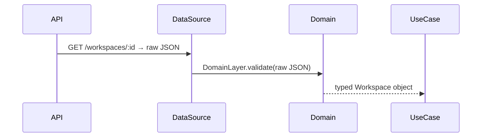

# Chapter 10: Domain Layer (Models & Interfaces)

Welcome back! In [Chapter 9: Data-Source Layer (API Clients)](09_data_source_layer__api_clients__.md) we learned how to fetch raw JSON from HTTP or databases. Now it’s time for the **Domain Layer**—the place where we define our core business objects (Workspaces, Apps, Users, etc.) and make sure their shape and rules are correct before any storage or logic runs.

---

## Why the Domain Layer?

Think of your application like a language:

- **Models** are the dictionary—each word (Workspace, App, User) has a precise definition.  
- **Interfaces** are the grammar—how words combine (input models, response shapes).

By defining schemas and types here, we catch mistakes early:  
- A workspace always has an `id`, a valid `name`, and a `createdAt` date.  
- A create-workspace request must include a `tenantId` and a `name` of at least 3 characters.

### Central Use Case

> **Use Case:** You receive raw JSON for a workspace from your API. Before your use-case calls it “Workspace,” you want to validate and transform it into a TypeScript-safe object.

---

## Key Concepts

1. **Zod Schemas & TypeScript Types**  
   - We use [Zod](https://github.com/colinhacks/zod) to define `WorkspaceSchema`.  
   - From that we infer a TypeScript `Workspace` type.  

2. **Create vs. Update Models**  
   - **CreateModel**: fields required when creating (no `id`, no dates).  
   - **UpdateModel**: extends CreateModel + `id`, optional fields for partial updates.  

3. **Response Interfaces**  
   - Every operation returns an interface like `WorkspaceResponse` or `WorkspacesResponse`.  
   - These have `data?` and `error?` so UI or use-cases can handle both success and failure consistently.

---

## Validating Raw JSON

Imagine you fetched this from the server:

```ts
const raw = {
  id: 'ws_123',
  name: 'My Project',
  shortName: 'proj',
  ownerId: 'user_1',
  memberIds: ['user_1'],
  tags: ['important'],
  status: 'active',
  createdAt: '2024-01-01T12:00:00Z',
  updatedAt: '2024-01-02T15:30:00Z'
}
```

We run it through our schema:

```ts
import { WorkspaceSchema } from '~/domain/model/workspace'

const workspace = WorkspaceSchema.parse({
  ...raw,
  createdAt: new Date(raw.createdAt),
  updatedAt: new Date(raw.updatedAt)
})
```

After parsing:

- `workspace` is typed as `Workspace`.  
- If a field is missing or wrong type, `parse()` throws and we catch it.

---

## High-Level Flow



1. **DataSource** fetches raw JSON.  
2. **Domain Layer** (our schemas) validates & transforms.  
3. Use-case works with safe, typed objects—no surprises.

---

## Inside `workspace.ts`

Let’s peek at a simplified `src/domain/model/workspace.ts`:

```ts
import { z } from 'zod'

// 1) Define the full Workspace object
export const WorkspaceSchema = z.object({
  id: z.string(),
  name: z.string(),
  shortName: z.string().optional(),
  ownerId: z.string(),
  memberIds: z.array(z.string()),
  tags: z.array(z.string()),
  status: z.enum(['active','inactive','archived']),
  createdAt: z.date(),
  updatedAt: z.date(),
  archivedAt: z.date().optional()
})

export type Workspace = z.infer<typeof WorkspaceSchema>

// 2) Define what’s needed when creating
export const WorkspaceCreateModelSchema = z.object({
  tenantId: z.string(),
  ownerId: z.string(),
  name: z.string().min(3)
})
export type WorkspaceCreateModel = z.infer<
  typeof WorkspaceCreateModelSchema
>

// 3) Response shape
export interface WorkspaceResponse {
  data?: Workspace
  error?: string
}
export interface WorkspacesResponse {
  data?: Workspace[]
  error?: string
}
```

- **WorkspaceSchema**: the “dictionary entry” for a workspace.  
- **CreateModelSchema**: grammar rule for creation.  
- **Response interfaces**: uniform `{ data?, error? }` shapes.

---

## Using the Schemas in Code

### 1) Validating a Create Form

```ts
import { WorkspaceCreateModelSchema } from '~/domain/model/workspace'

function validateForm(formData: FormData) {
  // Gather fields
  const input = {
    tenantId: formData.get('tenantId'),
    ownerId: formData.get('ownerId'),
    name: formData.get('name')
  }
  // This throws if invalid
  return WorkspaceCreateModelSchema.parse(input)
}
```

If `name` is under 3 characters, `parse` will throw a clear error you can show to the user.

### 2) Typing API Responses

In your repository after fetching:

```ts
import { WorkspaceSchema } from '~/domain/model/workspace'

async function getWorkspace(id: string): Promise<Workspace> {
  const json = await fetch(`/api/workspaces/${id}`).then(r => r.json())
  // Validate & transform
  return WorkspaceSchema.parse({ 
    ...json, 
    createdAt: new Date(json.createdAt), 
    updatedAt: new Date(json.updatedAt)
  })
}
```

Now the rest of your app knows `getWorkspace()` always returns a perfect `Workspace`.

---

## Summary

In this chapter you learned how to:

- Define **Zod schemas** and infer TypeScript **types** for each domain object.  
- Create **CreateModel** and **Response** interfaces for uniform input and output shapes.  
- Validate raw JSON or form inputs early, catching errors before they reach business logic.  
- Keep your use-cases, repositories, and UI confident they’re dealing with correct data.

Great job! You’ve now mastered the **Domain Layer**, the “dictionary and grammar” of your **alpha** app’s language. This solid foundation ensures data is always correct and consistent as it flows through your use-cases and beyond.

---

Generated by [AI Codebase Knowledge Builder](https://github.com/The-Pocket/Tutorial-Codebase-Knowledge)