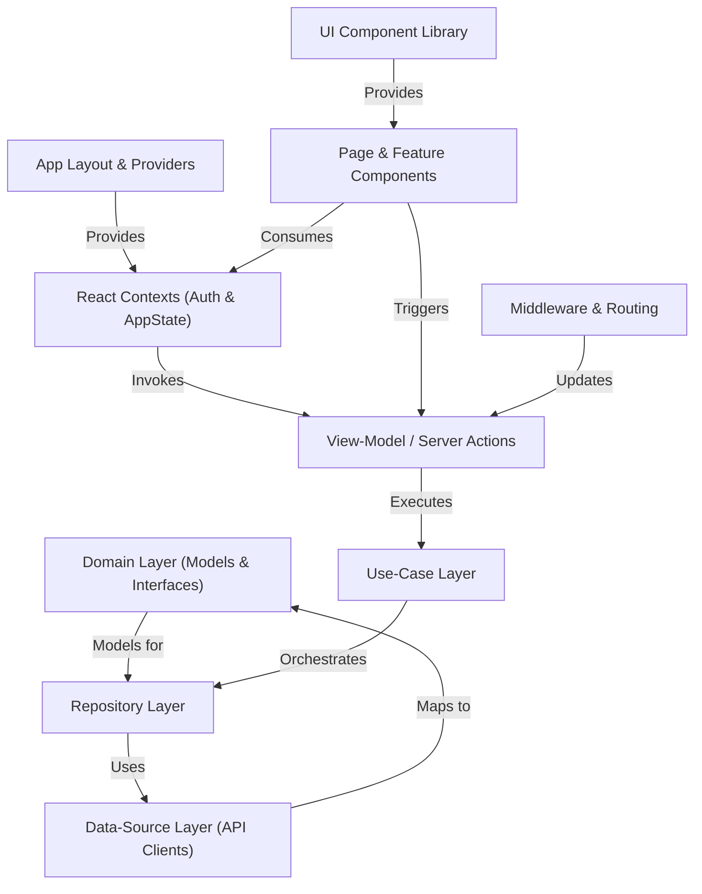

# Development Tutorial: web-ui alpha

**Chorus** is a *layered* Next.js application that serves as a secure research platform.
It defines **domain models** to enforce data shapes, uses **repositories** and **API clients** to fetch and persist data,
and orchestrates business logic through **use-cases**.
A consistent **UI component library** powers pages and features,
while *React Contexts* and *server actions* handle authentication and global state,
and middleware secures routing.

**Source Repository:** [https://github.com/CHORUS-TRE/chorus-web-ui/tree/alpha](https://github.com/CHORUS-TRE/chorus-web-ui/tree/alpha)

## Chapters

1. [App Layout & Providers
](01_app_layout___providers_.md)
2. [Middleware & Routing
](02_middleware___routing_.md)
3. [React Contexts (Auth & AppState)
](03_react_contexts__auth___appstate__.md)
4. [View-Model / Server Actions
](04_view_model___server_actions_.md)
5. [UI Component Library
](05_ui_component_library_.md)
6. [Page & Feature Components
](06_page___feature_components_.md)
7. [Use-Case Layer
](07_use_case_layer_.md)
8. [Repository Layer
](08_repository_layer_.md)
9. [Data-Source Layer (API Clients)
](09_data_source_layer__api_clients__.md)
10. [Domain Layer (Models & Interfaces)
](10_domain_layer__models___interfaces__.md)

---

Generated by [AI Codebase Knowledge Builder](https://github.com/The-Pocket/Tutorial-Codebase-Knowledge)