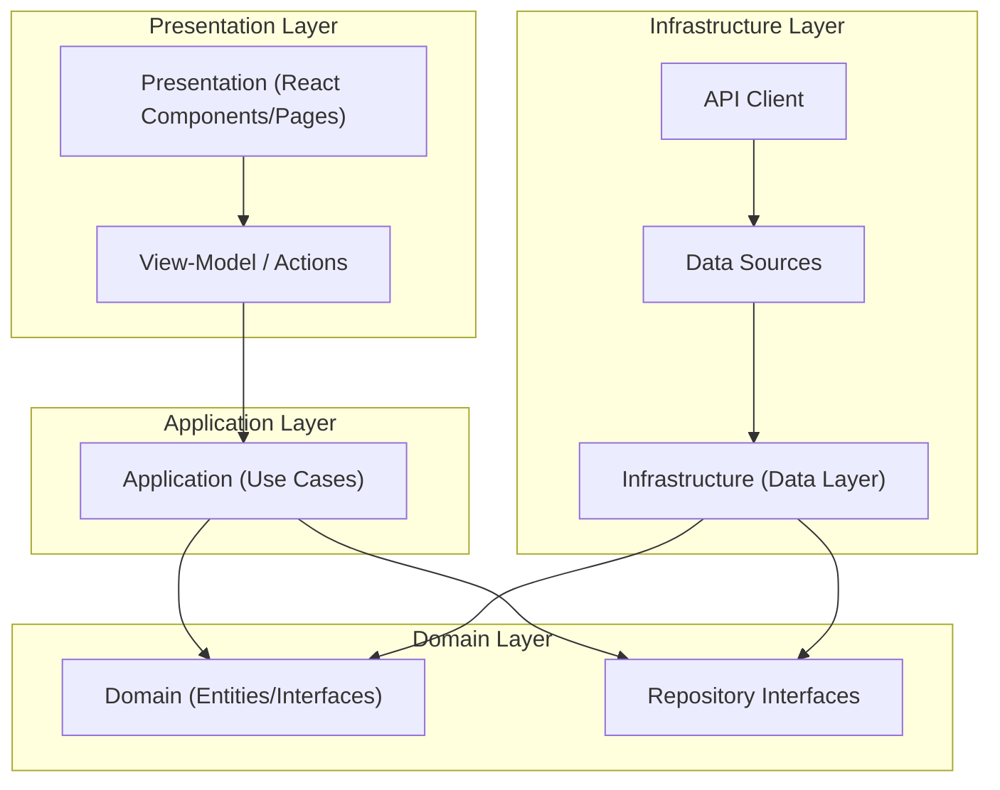

# System Patterns

## 1. System Architecture

The application aims to follow a Clean Architecture pattern, separating concerns into distinct layers.

- **Presentation Layer (`src/app`, `src/components`):** Contains UI components and pages. The View-Model / Actions layer (`src/components/actions`) is called to handle user interactions.
- **Application Layer (`src/domain/use-cases`):** Orchestrates the flow of data and triggers business logic.
- **Domain Layer (`src/domain/model`, `src/domain/repository`):** Contains core business entities, validation schemas (Zod), and repository interfaces.
- **Infrastructure Layer (`src/data`):** Contains repository implementations and data sources that communicate with external services like the Chorus API.

## 2. Key Technical Decisions

- **Authentication Architecture Shift:** Moving from server-side authentication middleware to client-side state management approach:
  - Layout components split into authenticated/unauthenticated states
  - Background iframe integration for application hosting
  - Client-side context providers for auth state
- **View-Model and Data Fetching Strategy:** The primary approach is client-side data fetching. "View-Model" files in `src/components/actions` use `fetch` to call API routes. As an exception for progressive enhancement, form submissions are handled by Next.js Server Actions, which call use cases and return state to the UI.
- **Repository Pattern:** This is the core of our data handling strategy.
  - **Interface (`domain/repository`):** Defines the contract for data operations, using domain models (e.g., `App`, `AppCreateType`).
  - **Implementation (`data/repository`):** Implements the interface. It calls the data source, and its primary responsibility is to catch errors and map the raw data source response into the standard `Result<T>` object (`{ data?, error?, issues? }`).
- **Data Source Pattern:**
  - **Interface (`data/data-source`):** Defines the contract for interacting with the backend, using raw API client types (e.g., `ChorusApp`, `ChorusCreateAppReply`).
  - **Implementation (`data/data-source/chorus-api`):** Implements the interface, making direct calls to the generated API client. It is responsible for mapping domain types (e.g., `AppCreateType`) to API types (`ChorusApp`) before sending the request.
- **Zod for Validation:** Zod schemas in `domain/model` are the single source of truth for validation. They are used in server actions and repository implementations to ensure data integrity.
- **Generated API Client:** Using OpenAPI generator to create a strongly-typed API client, ensuring type safety when communicating with the backend.

## 3. Proven Patterns

### Role Management Implementation
The role management feature demonstrates the effectiveness of our architectural patterns:
- **Recursive Domain Models:** Role entity supports inheritance with `z.lazy()` for recursive Zod schemas
- **Complex UI Components:** RoleMatrix component handles complex permission/role relationships
- **Mock Data Sources:** Effective pattern for development before backend integration

### Authentication State Management
- **Client-Side Context Providers:** Moving authentication state to React Context for better client-side control
- **Layout Composition:** Authenticated/unauthenticated layout components for clear separation of concerns
- **Background Integration:** Iframe components for hosting user applications within the main interface

## 4. Initial Data Loading for Client Providers

A common requirement is to provide initial state (e.g., authentication status) to client-side providers. To avoid server/client boundary errors, the following pattern is used:

1.  **Fetch in Root Server Component:** The initial data is fetched in the root `layout.tsx`, which is a Server Component. This is the only place where server-side functions like `cookies()` or `userMe()` should be called for initial state.
2.  **Pass as Props:** The fetched data is passed as props to the client-side `Providers` component.
3.  **Accept in Client Component:** The `Providers` component (`'use client'`) is a standard (non-async) component that accepts the initial state via props and passes it to the React Context providers.

This pattern ensures that no server functions are called during the initial client-side render, preventing fetch waterfalls and errors.
