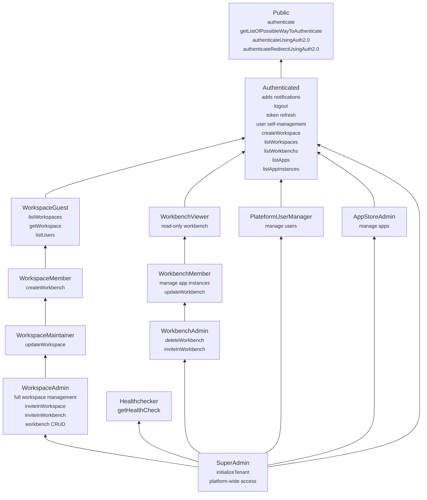

```mermaid
 graph BT
    %% Base roles
    Public["Public<br><small>authenticate<br>getListOfPossibleWayToAuthenticate<br>authenticateUsingAuth2.0<br>authenticateRedirectUsingAuth2.0</small>"]
    Authenticated["Authenticated<br><small>adds notifications<br>logout<br>token refresh<br>user self-management<br>createWorkspace<br>listWorkspaces<br>listWorkbenchs<br>listApps<br>listAppInstances</small>"]

    %% Workspace roles
    WorkspaceGuest["WorkspaceGuest<small><br>listWorkspaces<br>getWorkspace<br>listUsers</small>"]
    WorkspaceMember["WorkspaceMember<small><br>createWorkbench</small>"]
    WorkspaceMaintainer["WorkspaceMaintainer<small><br>updateWorkspace</small>"]
    WorkspaceAdmin["WorkspaceAdmin<small><br>full workspace management<br>inviteInWorkspace<br>inviteInWorkbench<br>workbench CRUD</small>"]

    %% Workbench roles
    WorkbenchViewer["WorkbenchViewer <small><br>read-only workbench</small>"]
    WorkbenchMember["WorkbenchMember<small><br>manage app instances<br>updateWorkbench</small>"]
    WorkbenchAdmin["WorkbenchAdmin<small><br>deleteWorkbench<br>inviteInWorkbench</small>"]

    %% Platform roles
    Healthchecker["Healthchecker<br>getHealthCheck<small>"]
    PlateformUserManager["PlateformUserManager<small><br>manage users</small>"]
    AppStoreAdmin["AppStoreAdmin<small><br>manage apps</small>"]
    SuperAdmin["SuperAdmin<small><br>initializeTenant<br>platform-wide access</small>"]

    %% Connections
    Authenticated --> Public
    WorkspaceGuest --> Authenticated
    WorkspaceMember --> WorkspaceGuest
    WorkspaceMaintainer --> WorkspaceMember
    WorkspaceAdmin --> WorkspaceMaintainer

    WorkbenchViewer --> Authenticated
    WorkbenchMember --> WorkbenchViewer
    WorkbenchAdmin --> WorkbenchMember

    PlateformUserManager --> Authenticated
    AppStoreAdmin --> Authenticated

    SuperAdmin --> Authenticated
    SuperAdmin --> PlateformUserManager
    SuperAdmin --> AppStoreAdmin
    SuperAdmin --> WorkspaceAdmin
    SuperAdmin --> WorkbenchAdmin
    SuperAdmin --> Healthchecker
```
